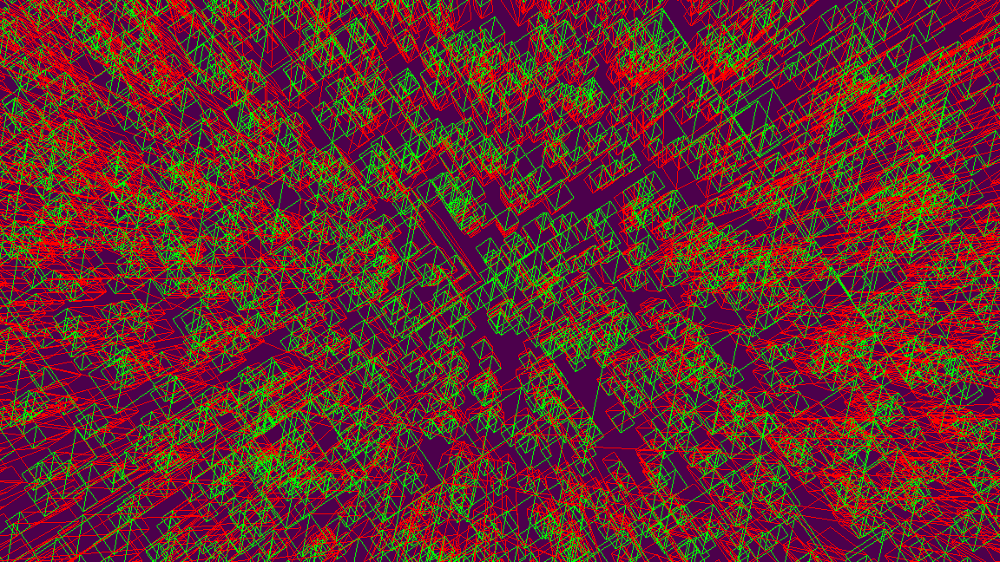
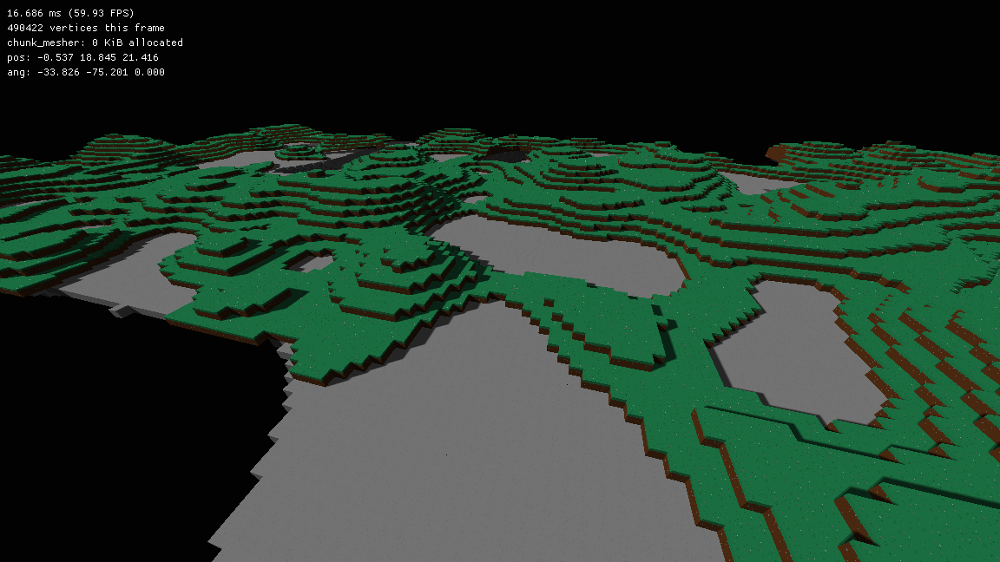

# Voxelius
Voxelius is a work-in-progress FOSS multiplayer voxel-based (actually it will be block-based like Minecraft) game written in C++17.  
My goal is to resemble as much of generic Minecraft gameplay as possible but with some core changes like cubic chunks.  
> Voxelius is _heavily_ inspired by [OpenBuilder](https://github.com/Hopson97/open-builder) (I am literally using OB's netcode as a reference to implement my protocol).

## Features
* ECS-based design (some things are managed outside of the ECS because it simply helps to not bloat the code).
* True Modern OpenGL (4.6) so no more binding buffers to write things to them.
* Threaded greedy meshing based on voxel faces.
* Possibly multiplayer support with a Minecraft-like protocol

## Work in progress
You can contribute if you want and I would appreciate that :)  
The current "milestone" is to achieve a correct client-server system and actually draw some chunks sent by the server.

## Screenshots
#### The first ever screenshot
This was in really early stage of development where there was still no greedy meshing.  

#### Pre-network code

